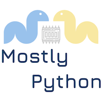

---
hide:
  - footer
title: Newsletter
---

# Newsletter

I write a weekly newsletter about (almost) all things Python at [Mostly Python](https://www.mostlypython.com). There are paid subscriptions available to support this ongoing work, but you can also sign up for a free subscription with access to all the same content. (Paid subscribers see some posts before free subscribers, but all posts end up available to everyone within 6 weeks.)

Most of what I write will be meaningful to anyone who has worked through a significant portion of *Python Crash Course*, and is interested in current takes on a variety of topics centered around Python. My goal is to help people transition out of the beginner mindset, and keep up with things that are happening in the Python world.

---

If you're curious to read some posts, you might want to start with one of these:

- [Python Lists: A closer look](https://www.mostlypython.com/python-lists-a-closer-look-7e0/)

    This series digs under the hood to see how lists work, and when to consider using a different kind of sequence in your projects.

- [OOP in Python](https://www.mostlypython.com/oop-in-python/)

    This series takes a deep dive into looking at how object-oriented programming works, and why it's so important.

- [Django from first principles series](https://www.mostlypython.com/django-from-first-principles-2/)

    This ongoing series builds a standard Django project by starting with a single .py file.
    
- [Reader questions](https://www.mostlypython.com/tag/reader-questions/)

    This is a collection of posts written in response to questions from readers.
    
- [Reflections](https://www.mostlypython.com/tag/reader-questions/)

    These posts are general reflections on Python, and programming in general. They include little or no code.
    
---

[{ align=right }](https://www.mostlypython.com)